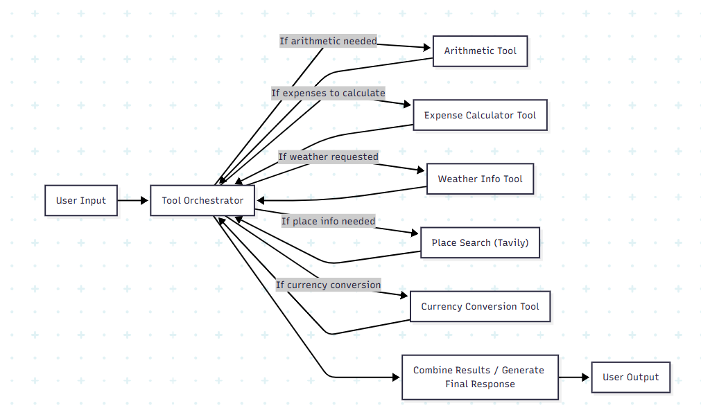

# Trip Planner Agentic AI

An **Agentic AI-powered trip planner** that helps users plan their trips with the assistance of specialized tools.  
The system takes a user query, routes it through a **Tool Orchestrator**, selects the appropriate tool(s), gathers results, and produces a **final trip response**.

---

## Features

- **Arithmetic Operations Tool** → Handles basic math for travel-related calculations.
- **Expense Calculator Tool** → Estimates and organizes trip costs.
- **Weather Info Tool** → Fetches real-time weather information for destinations.
- **Place Search Tool (Tavily Web Search)** → Finds information about places, attractions, and local highlights.
- **Currency Conversion Tool** → Converts currencies based on latest exchange rates.
- **Tool Orchestrator** → Core logic that decides which tool(s) to call depending on user queries.

---

